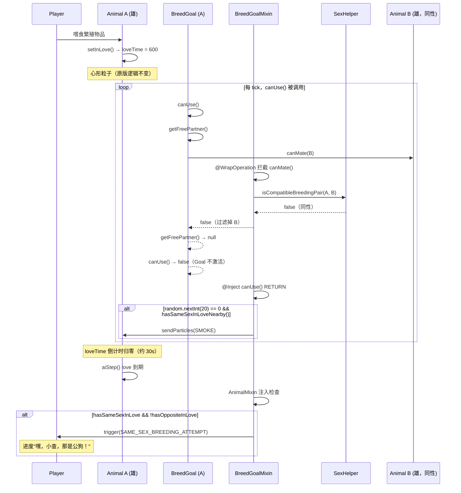
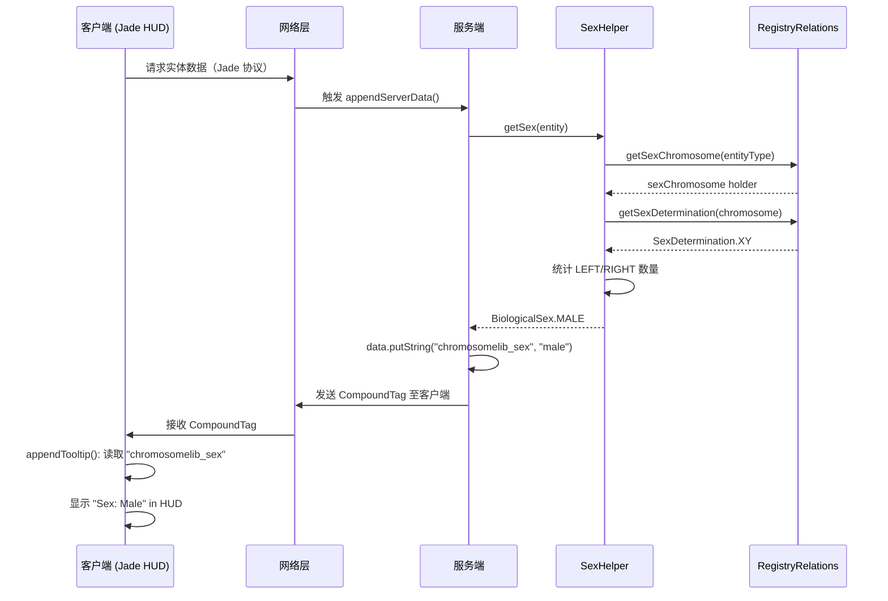
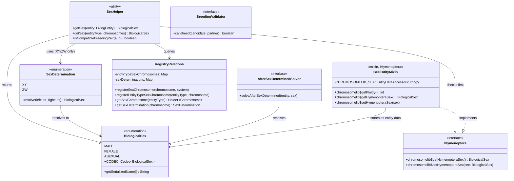
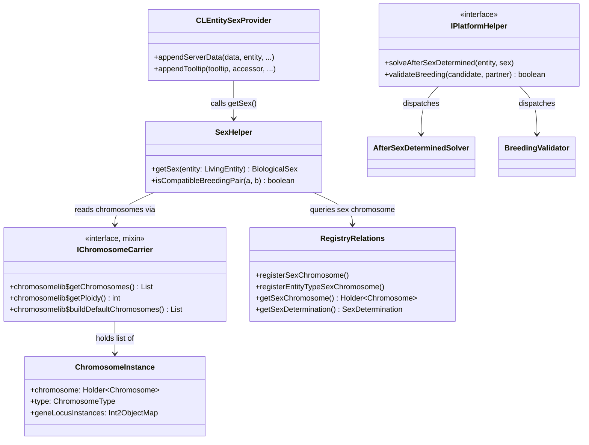

# 技术设计文档：Chromosome Lib v0.1.0

**版本：** 0.1.0+1.20.1

**日期：** 2026-04-02

**作者：** Liu Dongyu

**关联文档：** [产品需求文档 (PRD)](./PRD.md)

**修订日期：** 2026-04-02（根据评审意见修订）

**状态：**

- [ ] 草案
- [x] 评审中
- [ ] 已批准

---

## 0. 术语表

| 术语 | 定义 |
|------|------|
| **BiologicalSex** | 生物性别枚举：`MALE`（雄性）、`FEMALE`（雌性）、`ASEXUAL`（无性 / 性别未知）。纯计算值，不持久化。 |
| **SexDetermination** | 性别决定系统枚举：`XY`（哺乳类）、`ZW`（鸟类）。描述 `ChromosomeType` 组合如何映射到 `BiologicalSex`。蜜蜂等膜翅目不使用此系统，通过 `IHymenoptera` 接口直接存储性别。 |
| **ChromosomeType** | 染色体副本类型：`LEFT`（对应 X 或 Z 染色体）、`RIGHT`（对应 Y 或 W 染色体）。 |
| **LEFT / RIGHT** | 见 `ChromosomeType`。在 XY 系统中，雌性为 LEFT+LEFT（XX），雄性为 LEFT+RIGHT（XY）；在 ZW 系统中，雄性为 LEFT+LEFT（ZZ），雌性为 LEFT+RIGHT（ZW）。 |
| **IHymenoptera** | 膜翅目实体接口（蜜蜂等）。膜翅目的性别由倍性决定（单倍体 = 雄，二倍体 = 雌），生物学上不存在性染色体。此接口直接在实体数据中存储 `BiologicalSex`，并驱动 `chromosomelib$getPloidy()` 返回对应的倍性值（雄 = 1，雌 = 2）。 |
| **IChromosomeCarrier** | 通过 Mixin 注入到 `LivingEntity` 的接口，提供 `chromosomelib$getChromosomes()`（获取染色体实例列表）和 `chromosomelib$getPloidy()`（获取倍性）等方法。 |
| **ChromosomeInstance** | 单条染色体实例：包含染色体定义 `Holder<Chromosome>`、副本类型 `ChromosomeType`，以及各基因座位实例 `Int2ObjectMap<GeneLocusInstance>`。 |
| **RegistryRelations** | 跨注册表关联工具类。记录实体类型与性染色体的映射、性染色体与性别决定系统的映射，以及基因座位与染色体的关联。`freezeAndBuild()` 后变为只读。 |
| **SexHelper** | 性别查询工具类（静态方法）。优先检查实体是否实现 `IHymenoptera`；否则根据实体的染色体实例列表和 `SexDetermination` 计算 `BiologicalSex`，不做任何状态修改。 |
| **BreedingValidator** | P1 自定义繁殖限制接口。下游模组注册后，`BreedGoalMixin` 在 `getFreePartner()` 时叠加调用，任一返回 `false` 则阻止该对配对。 |
| **AfterSexDeterminedSolver** | P1 性别确定后回调接口。实体首次完成性状分配后触发，供下游模组响应性别信息（如外观初始化）。 |
| **Jade / WTHIT** | 第三方信息展示模组。Jade 为可选依赖（P0），WTHIT 为可选依赖（P1），通过各自的插件接口在实体 HUD 中展示性别信息。 |

---

## 1. 背景与范围

产品需求文档：[产品需求文档 (PRD)](./PRD.md)

本文档基于 v0.0.1 的代码架构，为 v0.1.0 的以下功能模块提供技术实现方案：

| 优先级 | 分级 | 功能模块 | 功能描述 |
|--------|------|----------|----------|
| P0 | A | XY / ZW 性别决定系统 | 新增 `BiologicalSex`、`SexDetermination` 枚举，通过性染色体组合决定实体性别 |
| P0 | A | 性别基因存储与查询 API | 新增 `SexHelper` 工具类，提供 `getSex()` 和 `isCompatibleBreedingPair()` 查询接口 |
| P0 | A | 繁殖时性别生成（50:50 比例） | 修改 `buildDefaultChromosomes()` 对性染色体随机生成 LEFT+LEFT 或 LEFT+RIGHT |
| P0 | A | 禁止同性繁殖（验证 + 交互反馈） | 注入 `BreedGoal.getFreePartner()` 过滤同性配偶；同性求爱时生成烟雾粒子并触发进度 |
| P0 | B | Jade 模组集成 | 实现 Jade 插件，在 HUD 中展示实体性别 |
| P1 | A | 单倍体 / 双倍体系统（蜜蜂） | 新增 `IHymenoptera` 接口，通过实体数据存储性别；`BeeEntityMixin` 实现接口并覆盖 `getPloidy()`，雄蜂返回 1，雌蜂返回 2 |
| P1 | B | 性别视觉表现（纹理 / 模型差异） | 通过客户端渲染器 Mixin 根据性别替换纹理路径，支持资源包覆盖 |
| P1 | B | WTHIT 模组集成 | 实现 WTHIT 插件，在 HUD 中展示实体性别（与 Jade 功能并行） |
| P1 | B | 同性繁殖特殊情况处理（蜜蜂、骡子） | 蜜蜂使用标准 `BreedGoal`，由通用 Mixin 处理；骡子无性染色体返回 ASEXUAL，自动跳过性别限制 |
| P1 | A | X / Z 连锁遗传机制 | 通过 `LeftGeneLocus` 注册连锁基因，现有架构天然支持，无需核心修改 |
| P1 | C | 性别事件回调 | 新增 `AfterSexDeterminedSolver` 接口，性别首次确定后回调下游模组 |
| P1 | C | 自定义繁殖限制 API | 新增 `BreedingValidator` 接口，下游模组可注册额外的繁殖兼容性条件 |

> 功能分级说明：**A** = 核心功能（直接实现需求目标）；**B** = 支撑功能（改善体验 / 扩展集成）；**C** = 通用功能（开放 API，面向下游模组开发者）。

---

## 2. 现有架构回顾

### 2.1 关键类与接口

```
ChromosomeInstance
  chromosome: Holder<Chromosome>   // 染色体定义
  type: ChromosomeType             // LEFT (X/Z) | RIGHT (Y/W)
  geneLocusInstances: Int2ObjectMap<GeneLocusInstance>

ChromosomeType { LEFT, RIGHT }

Chromosome
  index: int                       // 在实体内的染色体编号
  homoSegmentStartDiff: int        // 同源区段偏移
  necessaryChromosomeTypes: Map<Holder<Chromosome>, ChromosomeType>  // 静态全局

GeneLocus (抽象)
  ├── LeftGeneLocus    (仅存在于 LEFT 染色体)
  ├── RightGeneLocus   (仅存在于 RIGHT 染色体)
  └── HomologousGeneLocus (两条染色体均有)

IChromosomeCarrier (LivingEntity 通过 Mixin 实现)
  chromosomelib$getChromosomes() : List<ChromosomeInstance>
  chromosomelib$getPloidy()      : int  (default 2)

RegistryRelations
  registerNecessaryChromosomeTypes(chromosome, ChromosomeType)
    → 强制某条染色体的所有副本都生成为指定类型

IPlatformHelper
  solveUnpairedChromosomesToBreed(...)  // 处理奇数条染色体
  solveAfterAssigningTrait(...)         // 性状分配后回调
```

### 2.2 当前性染色体处理方式的问题

`BuiltInChromosomes` 对所有物种的性染色体均调用了：
```java
RegistryRelations.registerNecessaryChromosomeTypes(SHEEP_XY, ChromosomeType.LEFT);
```

这会导致所有自然生成的动物都携带 LEFT+LEFT（XX 或 ZZ）类型的性染色体，无法体现性别多样性。繁殖时虽然能随机传递染色体，但亲本均为同一性别，后代也只能为同一性别。

**结论：v0.1.0 需要彻底重新设计性染色体的生成和管理机制。**

---

## 3. 核心设计

### 3.1 性别决定系统设计

#### 3.1.1 新增枚举：`BiologicalSex`

```
common/src/main/java/com/hexagram2021/chromosomelib/common/sex/BiologicalSex.java
```

```java
/**
 * The biological sex of an entity.
 */
public enum BiologicalSex implements StringRepresentable {
    MALE,
    FEMALE,
    ASEXUAL;

    public static final Codec<BiologicalSex> CODEC = StringRepresentable.fromEnum(BiologicalSex::values);

    @Override
    public String getSerializedName() { ... }
}
```

#### 3.1.2 新增枚举：`SexDetermination`

```
common/src/main/java/com/hexagram2021/chromosomelib/common/sex/SexDetermination.java
```

```java
/**
 * The sex determination system for a species using sex chromosomes.
 * Determines how ChromosomeType (LEFT/RIGHT) maps to biological sex.
 *
 * <p>Note: Hymenoptera (bees) use haplodiploidy and do NOT use this enum.
 * Their sex is stored directly via {@link IHymenoptera}.</p>
 */
public enum SexDetermination {
    /**
     * Mammalian: LEFT+LEFT = FEMALE (XX), LEFT+RIGHT = MALE (XY).
     * Sex determined by the father (Y chromosome provider).
     */
    XY,
    /**
     * Avian: LEFT+LEFT = MALE (ZZ), LEFT+RIGHT = FEMALE (ZW).
     * Sex determined by the mother (W chromosome provider).
     */
    ZW;

    /**
     * Resolves biological sex from sex chromosome instances.
     *
     * @param left  count of LEFT-type sex chromosome instances
     * @param right count of RIGHT-type sex chromosome instances
     * @return the resolved biological sex
     */
    public BiologicalSex resolve(int left, int right) {
        return switch (this) {
            case XY -> (right > 0) ? BiologicalSex.MALE : BiologicalSex.FEMALE;
            case ZW -> (right > 0) ? BiologicalSex.FEMALE : BiologicalSex.MALE;
        };
    }
}
```

#### 3.1.3 新增工具类：`SexHelper`

```
common/src/main/java/com/hexagram2021/chromosomelib/common/sex/SexHelper.java
```

```java
/**
 * Utility class for querying the biological sex of entities.
 */
public final class SexHelper {
    /**
     * Returns the biological sex of the given living entity.
     *
     * <p>Resolution order:
     * <ol>
     *   <li>If the entity implements {@link IHymenoptera}, returns the stored sex directly.</li>
     *   <li>Otherwise, derives sex from sex chromosome instances via {@link SexDetermination}.</li>
     *   <li>If no sex chromosome is registered for the entity type, returns {@link BiologicalSex#ASEXUAL}.</li>
     * </ol>
     *
     * @param entity the living entity to query
     * @return the biological sex
     */
    public static BiologicalSex getSex(LivingEntity entity) {
        // Hymenoptera (bees): sex is stored directly, not derived from chromosomes
        if (entity instanceof IHymenoptera hymenoptera) {
            return hymenoptera.chromosomelib$getHymenopteraSex();
        }
        return getSex(entity.getType(), ((IChromosomeCarrier) entity).chromosomelib$getChromosomes());
    }

    /**
     * Returns the biological sex based on chromosome instances and entity type.
     * This overload is used for chromosome-based sex determination only (XY / ZW).
     * For Hymenoptera entities, use {@link #getSex(LivingEntity)} instead.
     *
     * @param entityType the entity type
     * @param chromosomes the chromosome instance list
     * @return the biological sex
     */
    public static BiologicalSex getSex(EntityType<?> entityType,
                                        Collection<ChromosomeInstance> chromosomes) {
        Holder<Chromosome> sexChromosome = RegistryRelations.getSexChromosome(entityType);
        if (sexChromosome == null) {
            return BiologicalSex.ASEXUAL;
        }
        SexDetermination system = RegistryRelations.getSexDetermination(sexChromosome);
        if (system == null) {
            return BiologicalSex.ASEXUAL;
        }

        // Count LEFT and RIGHT instances of the sex chromosome
        int left = 0, right = 0;
        for (ChromosomeInstance inst : chromosomes) {
            if (inst.chromosome().equals(sexChromosome)) {
                if (inst.type() == ChromosomeType.LEFT) left++;
                else right++;
            }
        }
        return system.resolve(left, right);
    }

    /**
     * Returns whether two entities can breed based on sex compatibility.
     * Entities with ASEXUAL sex are always compatible.
     *
     * @param entityA first entity
     * @param entityB second entity
     * @return true if the pair is a valid breeding pair
     */
    public static boolean isCompatibleBreedingPair(LivingEntity entityA, LivingEntity entityB) {
        BiologicalSex sexA = getSex(entityA);
        BiologicalSex sexB = getSex(entityB);
        if (sexA == BiologicalSex.ASEXUAL || sexB == BiologicalSex.ASEXUAL) {
            return true;
        }
        return sexA != sexB;
    }

    private SexHelper() {}
}
```

#### 3.1.4 修改 `RegistryRelations`

新增以下字段和方法：

```java
// 新增静态字段（仅在 freezeAndBuild 前可写入）
private static final Map<EntityType<?>, Holder<Chromosome>> entityTypeSexChromosomes = Maps.newHashMap();
private static final Map<Holder<Chromosome>, SexDetermination> sexDeterminations = Maps.newHashMap();

/**
 * Registers a sex chromosome and its determination system for an entity type.
 * Must be called before freezeAndBuild().
 *
 * @param chromosome     the sex chromosome holder
 * @param system         the sex determination system (XY or ZW)
 */
public static void registerSexChromosome(Holder<Chromosome> chromosome,
                                          SexDetermination system) {
    checkNotFrozen();
    sexDeterminations.put(chromosome, system);
}

/**
 * Associates an entity type with its sex chromosome.
 * Should be called when registering the sex chromosome via
 * registerEntityType2Chromosome.
 */
public static void registerEntityTypeSexChromosome(EntityType<?> entityType,
                                                    Holder<Chromosome> chromosome) {
    checkNotFrozen();
    entityTypeSexChromosomes.put(entityType, chromosome);
}

// 查询方法（freezeAndBuild 后可用）
@Nullable
public static Holder<Chromosome> getSexChromosome(EntityType<?> entityType) { ... }

@Nullable
public static SexDetermination getSexDetermination(Holder<Chromosome> chromosome) { ... }
```

#### 3.1.5 修改 `buildDefaultChromosomes`

在 `IChromosomeCarrier.buildDefaultChromosomes()` 中，针对性染色体特殊处理：

```java
default List<ChromosomeInstance> chromosomelib$buildDefaultChromosomes(
    IChromosomeLibEntityType entityType,
    IWeightedGeneList.Context context) {

    return entityType.chromosomelib$getChromosomes().values().stream()
        .<ChromosomeInstance>mapMulti((chromosome, consumer) -> {
            int ploidy = this.chromosomelib$getPloidy();
            SexDetermination sexSystem = RegistryRelations.getSexDetermination(chromosome);

            if (sexSystem != null) {
                // 性染色体：根据性别决定系统随机生成性别（50:50）
                generateSexChromosomeInstances(chromosome, sexSystem, ploidy, context, consumer);
            } else {
                // 普通染色体：按 ploidy 生成，类型由 necessaryType 或随机决定
                ChromosomeInstance last = null;
                for (int i = 0; i < ploidy; ++i) {
                    ChromosomeType type = Chromosome.getNecessaryChromosomeType(chromosome);
                    if (type == null) {
                        type = context.random().nextBoolean()
                            ? ChromosomeType.LEFT : ChromosomeType.RIGHT;
                    }
                    last = ChromosomeInstance.of(chromosome, type, context.withLast(last));
                    consumer.accept(last);
                }
            }
        }).toList();
}

// 性染色体实例生成逻辑（仅用于 XY / ZW 系统，蜜蜂不经过此路径）
private static void generateSexChromosomeInstances(
    Holder<Chromosome> chromosome, SexDetermination system,
    int ploidy, IWeightedGeneList.Context context,
    Consumer<ChromosomeInstance> consumer) {

    // ploidy = 1 时只生成一条 LEFT（保留为通用扩展点，正常物种不会走此分支）
    if (ploidy == 1) {
        consumer.accept(ChromosomeInstance.of(chromosome, ChromosomeType.LEFT, context));
        return;
    }

    // 二倍体：50% 生成 LEFT+LEFT，50% 生成 LEFT+RIGHT
    boolean rightType = context.random().nextBoolean();
    ChromosomeInstance left = ChromosomeInstance.of(
        chromosome, ChromosomeType.LEFT, context);
    ChromosomeInstance right = ChromosomeInstance.of(
        chromosome, rightType ? ChromosomeType.RIGHT : ChromosomeType.LEFT,
        context.withLast(left));
    consumer.accept(left);
    consumer.accept(right);
}
```

**注意**：`BuiltInChromosomes` 中所有对 `registerNecessaryChromosomeTypes` 的调用（性染色体相关）均应替换为 `registerSexChromosome`，并调用 `registerEntityTypeSexChromosome`。

---

### 3.2 `BuiltInChromosomes` 修改方案

以羊为例，原始代码：
```java
RegistryRelations.registerEntityType2Chromosome(EntityType.SHEEP, SHEEP_XY);
RegistryRelations.registerNecessaryChromosomeTypes(SHEEP_XY, ChromosomeType.LEFT);
```

修改为：
```java
RegistryRelations.registerEntityType2Chromosome(EntityType.SHEEP, SHEEP_XY);
RegistryRelations.registerSexChromosome(SHEEP_XY, SexDetermination.XY);
RegistryRelations.registerEntityTypeSexChromosome(EntityType.SHEEP, SHEEP_XY);
```

鸡（ZW 系统）：
```java
RegistryRelations.registerEntityType2Chromosome(EntityType.CHICKEN, CHICKEN_ZW);
RegistryRelations.registerSexChromosome(CHICKEN_ZW, SexDetermination.ZW);
RegistryRelations.registerEntityTypeSexChromosome(EntityType.CHICKEN, CHICKEN_ZW);
```

**蜜蜂（P1）不进行性染色体注册**：蜜蜂的性别通过 `IHymenoptera` 接口直接存储，不使用 `SexDetermination` 体系，因此无需调用 `registerSexChromosome()` 或 `registerEntityTypeSexChromosome()`。蜜蜂的所有染色体均经由"普通染色体"路径（按 `getPloidy()` 生成副本数）构建，性别决定倍性，倍性决定染色体副本数。

#### 3.2.1 向后兼容处理（Breaking Change 说明）

`registerNecessaryChromosomeTypes` → `registerSexChromosome` 是**破坏性 API 变更**。为降低对下游模组开发者的影响：

1. **保留 `registerNecessaryChromosomeTypes` 方法，添加 `@Deprecated` 注解**，在方法 Javadoc 中注明废弃原因和迁移方式；
2. **废弃方法的行为不变**（仍可用于非性染色体的强制类型注册），但对性染色体无效；
3. v0.1.0 为此库的早期版本，下游模组数量极少，迁移影响可控。

废弃示例：
```java
/**
 * @deprecated For sex chromosomes, use {@link #registerSexChromosome} and
 *             {@link #registerEntityTypeSexChromosome} instead.
 *             This method remains valid for forcing non-sex chromosomes to a fixed type.
 */
@Deprecated
public static void registerNecessaryChromosomeTypes(Holder<Chromosome> chromosome,
                                                     ChromosomeType type) { ... }
```

---

### 3.3 禁止同性繁殖

#### 3.3.1 设计目标

- 同性两只动物喂食繁殖物品后，**均可进入求爱状态**（原版心形粒子保留）；
- 在求爱状态搜索配偶时，**过滤掉同性个体**；
- 当动物处于求爱状态、周围仅有同性求爱伙伴时，**偶尔（约 1/4 概率/tick）产生烟雾粒子**；
- 当求爱状态超时结束时，若满足条件（有同性求爱伙伴、无异性求爱伙伴），**触发进度**【嘿，小查，那是公狗！】；
- 与其他模组的自定义繁殖逻辑**完全兼容**：仅干预 `BreedGoal` 的选伴逻辑，不影响其他繁殖路径。

#### 3.3.2 Mixin 策略

**目标类**：`net.minecraft.world.entity.ai.goal.BreedGoal`

经阅读 `BreedGoal` 反编译源码确认：
- `tick()` 方法只负责移动和倒计时，**不含任何 `Stream.filter()` 调用**；
- 配偶搜索在 `getFreePartner()` 私有方法中完成，通过 `for` 循环调用 `Animal.canMate(Animal)`；
- `tick()` 仅在 `canUse()` 返回 `true`（已找到配偶）后才会被调用。

因此：
- 性别过滤的注入点为 `getFreePartner()` 中的 `canMate()` 调用，而非 `tick()` 的流过滤；
- 烟雾粒子的注入点为 `canUse()` 返回（配偶未找到但处于求爱状态时），而非 `tick()@TAIL`；
- 进度触发注入点位于 `AnimalMixin`（love 计时器归零时），而非 `BreedGoal.stop()`（无配偶时 Goal 不会激活，`stop()` 不会被调用）。

| 注入点 | 方法 | 方式 | 目的 |
|--------|------|------|------|
| 性别 + 自定义校验过滤 | `BreedGoal.getFreePartner()` | `@WrapOperation` on `canMate()` | 同性候选配偶被过滤；自定义 Validator 叠加校验 |
| 烟雾粒子 | `BreedGoal.canUse()` | `@Inject` at `RETURN` | 求爱状态下无异性配偶时偶尔生成烟雾 |
| 进度触发 | `Animal.aiStep()` | `@Inject`（love 计时器归零处） | love 到期且仅有同性求爱伙伴时触发成就 |

**新增 Mixin 文件**：
```
common/src/main/java/com/hexagram2021/chromosomelib/mixin/BreedGoalMixin.java
common/src/main/java/com/hexagram2021/chromosomelib/mixin/AnimalMixin.java
```

核心逻辑（伪代码）：

```java
@Mixin(BreedGoal.class)
public abstract class BreedGoalMixin {
    @Shadow protected Animal animal;
    @Shadow @Final protected Level level;
    @Shadow @Nullable protected Animal partner;

    /**
     * Filters out same-sex partners and runs custom BreedingValidators during
     * partner search.
     *
     * <p>Wraps the {@code canMate()} call inside {@code getFreePartner()} —
     * the actual filtering site in BreedGoal. The previously assumed
     * {@code Stream.filter()} in {@code tick()} does not exist in the source.</p>
     */
    @WrapOperation(
        method = "getFreePartner",
        at = @At(value = "INVOKE",
            target = "Lnet/minecraft/world/entity/animal/Animal;canMate(Lnet/minecraft/world/entity/animal/Animal;)Z"))
    private boolean chromosomelib$checkSexAndValidateBreeding(
        Animal self, Animal candidate, Operation<Boolean> original) {
        return original.call(self, candidate)
            && SexHelper.isCompatibleBreedingPair(self, candidate)
            && Services.PLATFORM.validateBreeding(self, candidate);
    }

    /**
     * Spawns smoke particles when the animal is in love but cannot find an
     * opposite-sex partner.
     *
     * <p>Injected at {@code canUse()} RETURN: when {@code getFreePartner()}
     * returns null (no valid partner) but the animal is still in love (same-sex
     * blocking), this is the earliest correct injection point.
     * {@code tick()} is never reached when no partner exists.</p>
     */
    @Inject(method = "canUse", at = @At(value = "RETURN"))
    private void chromosomelib$onCanUseFailed(CallbackInfoReturnable<Boolean> cir) {
        if (cir.getReturnValue()) return;   // partner found, nothing to do
        if (!this.animal.isInLove()) return;
        if (this.animal.level().isClientSide()) return;

        // 偶尔生成烟雾粒子（约 1/20 概率/tick）
        if (this.animal.level().random.nextInt(20) == 0
                && chromosomelib$hasSameSexInLoveNearby()) {
            ((ServerLevel) this.animal.level()).sendParticles(
                ParticleTypes.SMOKE,
                this.animal.getX(), this.animal.getY() + 0.5, this.animal.getZ(),
                1, 0.2, 0.2, 0.2, 0.0);
        }
    }

    @Unique
    private boolean chromosomelib$hasSameSexInLoveNearby() {
        BiologicalSex selfSex = SexHelper.getSex(this.animal);
        if (selfSex == BiologicalSex.ASEXUAL) return false;
        return this.level.getNearbyEntities(this.animal.getClass(),
            BreedGoal.PARTNER_TARGETING, this.animal, this.animal.getBoundingBox().inflate(8.0))
            .stream()
            .filter(Animal::isInLove)
            .anyMatch(candidate -> SexHelper.getSex(candidate) == selfSex);
    }

    @Unique
    private boolean chromosomelib$hasOppositeInLoveNearby() {
        return this.level.getNearbyEntities(this.animal.getClass(),
            BreedGoal.PARTNER_TARGETING, this.animal, this.animal.getBoundingBox().inflate(8.0))
            .stream()
            .filter(Animal::isInLove)
            .anyMatch(candidate -> SexHelper.isCompatibleBreedingPair(this.animal, candidate));
    }
}
```

**成就触发（`AnimalMixin`）**：

注入 `Animal.aiStep()` 中 `loveTime` 计时器归零的位置（love 到期时），检查同性条件并触发进度：

```java
@Mixin(Animal.class)
public abstract class AnimalMixin {
    // @Inject at the instruction where loveTime decrements to 0
    // (inside the isInLove() branch of aiStep / serverAiStep)
    private void chromosomelib$onLoveExpired(CallbackInfo ci) {
        Animal self = (Animal)(Object)this;
        if (self.level().isClientSide()) return;

        boolean hasSameSexInLove  = /* check nearby same-sex in love */;
        boolean hasOppositeInLove = /* check nearby opposite-sex in love */;

        if (hasSameSexInLove && !hasOppositeInLove) {
            ServerPlayer nearestPlayer =
                ((ServerLevel) self.level()).getNearestPlayer(self, 16.0);
            if (nearestPlayer != null) {
                CLCriteriaTriggers.SAME_SEX_BREEDING_ATTEMPT.trigger(nearestPlayer);
            }
        }
    }
}
```

**特殊情况处理（P1）：**

- **骡子**（`MuleEntityMixin`）：重写 `chromosomelib$getPloidy()` 返回 1，骡子没有配对的性染色体，`SexHelper.getSex()` 返回 `ASEXUAL`，自然跳过同性验证。
- **蜜蜂（P1）**：蜜蜂直接使用标准 `BreedGoal`（见 §3.10），通用 `BreedGoalMixin` 自动覆盖，**无需独立的蜜蜂繁殖 Mixin**。蜜蜂实现 `IHymenoptera`，`SexHelper.getSex()` 优先通过接口获取性别，正确区分雄/雌蜂。

#### 3.3.3 进度触发器

新增文件：
```
common/src/main/java/com/hexagram2021/chromosomelib/common/advancement/SameSeXBreedingAttemptTrigger.java
common/src/main/java/com/hexagram2021/chromosomelib/registry/CLCriteriaTriggers.java
```

触发器 ID：`chromosomelib:same_sex_breeding_attempt`

对应的进度 JSON 文件（Fabric 端）：
```
fabric/src/main/resources/data/chromosomelib/advancements/same_sex_breeding.json
```

进度配置：
```json
{
    "display": {
        "title": { "translate": "advancement.chromosomelib.same_sex_breeding.title" },
        "description": { "translate": "advancement.chromosomelib.same_sex_breeding.description" },
        "icon": { "item": "minecraft:lead" },
        "frame": "task",
        "announce_to_chat": true,
        "show_toast": true,
        "hidden": true
    },
    "criteria": {
        "same_sex_breeding": {
            "trigger": "chromosomelib:same_sex_breeding_attempt"
        }
    }
}
```

**Forge 端进度注册**：

Forge 端进度触发器通过 `RegisterCriteriaTriggers` 事件注册（在 `ChromosomeLibForge` 模组主类的 `@SubscribeEvent` 中调用 `CriteriaTriggers.register()`）。进度 JSON 文件与 Fabric 共享，放置路径相同：
```
forge/src/main/resources/data/chromosomelib/advancements/same_sex_breeding.json
```
该文件与 Fabric 端内容完全相同，因为进度系统的 JSON 格式在两个加载器之间一致（均遵循原版数据包规范）。
```

---

### 3.4 Jade 模组集成（P0）

#### 3.4.1 依赖配置

Jade 作为 **optional** 依赖加入 Fabric 和 Forge 两个模块。

**Fabric `fabric.mod.json`** 新增：
```json
"suggests": {
    "jade": "*"
}
```

**Forge `mods.toml`** 新增：
```toml
[[dependencies.chromosomelib]]
    modId = "jade"
    mandatory = false
    versionRange = "[11.0,)"
    ordering = "NONE"
    side = "CLIENT"
```

#### 3.4.2 新增集成类

```
fabric/src/main/java/com/hexagram2021/chromosomelib/fabric/compat/jade/CLJadePlugin.java
forge/src/main/java/com/hexagram2021/chromosomelib/forge/compat/jade/CLJadePlugin.java
```

两个模块的实现基本一致（可将核心逻辑抽取到 common 模块的辅助类）：

```java
/**
 * Jade plugin for Chromosome Lib: displays biological sex in the entity HUD.
 */
@JadeAlias("chromosomelib:sex_info")
public class CLJadePlugin implements IWailaPlugin {
    @Override
    public void register(IWailaCommonRegistration registration) {
        registration.registerEntityDataProvider(CLEntitySexProvider.INSTANCE, LivingEntity.class);
    }

    @Override
    public void registerClient(IWailaClientRegistration registration) {
        registration.registerEntityComponent(CLEntitySexProvider.INSTANCE, LivingEntity.class);
    }
}
```

**数据提供者**：
```
common/src/main/java/com/hexagram2021/chromosomelib/common/compat/jade/CLEntitySexProvider.java
```

```java
/**
 * Provides biological sex information for Jade HUD display.
 */
public class CLEntitySexProvider implements IEntityComponentProvider, IServerDataProvider<Entity> {
    public static final CLEntitySexProvider INSTANCE = new CLEntitySexProvider();
    public static final ResourceLocation UID = new ResourceLocation("chromosomelib", "sex_info");

    @Override
    public ResourceLocation getUid() { return UID; }

    @Override
    public void appendServerData(CompoundTag data, Entity entity, ServerLevel level,
                                  boolean showDetails) {
        if (entity instanceof LivingEntity living) {
            BiologicalSex sex = SexHelper.getSex(living);
            data.putString("chromosomelib_sex", sex.getSerializedName());
        }
    }

    @Override
    public void appendTooltip(ITooltip tooltip, EntityAccessor accessor,
                               IPluginConfig config) {
        String sexKey = accessor.getServerData().getString("chromosomelib_sex");
        if (sexKey.isEmpty()) return;

        Component sexText = switch (sexKey) {
            case "male"    -> Component.translatable("chromosomelib.sex.male");
            case "female"  -> Component.translatable("chromosomelib.sex.female");
            case "asexual" -> Component.translatable("chromosomelib.sex.asexual");
            default -> null;
        };
        if (sexText != null) {
            tooltip.add(Component.translatable("chromosomelib.jade.sex_label", sexText));
        }
    }

    private CLEntitySexProvider() {}
}
```

**Jade 注册入口点**（Fabric）：
- 在 `fabric.mod.json` 中配置 `jade` 入口点类：
```json
"entrypoints": {
    "jade": ["com.hexagram2021.chromosomelib.fabric.compat.jade.CLJadePlugin"]
}
```

**多语言文件** 新增（`common/src/main/resources/assets/chromosomelib/lang/`）：
```json
{
    "chromosomelib.jade.sex_label": "Sex: %s",
    "chromosomelib.sex.male": "Male",
    "chromosomelib.sex.female": "Female",
    "chromosomelib.sex.asexual": "Asexual",
    "advancement.chromosomelib.same_sex_breeding.title": "Hey, Charlie, That's a Male Dog!",
    "advancement.chromosomelib.same_sex_breeding.description": "Feed two animals of the same sex and watch them fail to breed."
}
```

---

### 3.5 WTHIT 模组集成（P1）

#### 3.5.1 依赖配置

WTHIT 作为 **optional** 依赖加入 Fabric 和 Forge 两个模块。

**Fabric `fabric.mod.json`** 新增：
```json
"suggests": {
    "wthit": "*"
}
```

**Forge `mods.toml`** 新增：
```toml
[[dependencies.chromosomelib]]
    modId = "wthit"
    mandatory = false
    versionRange = "[7.0,)"
    ordering = "NONE"
    side = "CLIENT"
```

#### 3.5.2 新增集成类

```
fabric/src/main/java/com/hexagram2021/chromosomelib/fabric/compat/wthit/CLWthitPlugin.java
forge/src/main/java/com/hexagram2021/chromosomelib/forge/compat/wthit/CLWthitPlugin.java
```

WTHIT 的插件注册接口为 `mcp.mobius.waila.api.IWailaPlugin`（与 Jade 的 `IWailaPlugin` 同名但包路径不同）。服务端数据提供直接复用 `CLEntitySexProvider.INSTANCE`；客户端显示通过 WTHIT 的 `IEntityComponentProvider` 接口实现，逻辑与 Jade 端完全相同：

```java
/**
 * WTHIT plugin for Chromosome Lib: displays biological sex in the entity HUD.
 */
public class CLWthitPlugin implements IWailaPlugin {
    @Override
    public void register(IWailaCommonRegistration registration) {
        // 复用 CLEntitySexProvider 的服务端数据写入逻辑
        registration.registerEntityDataProvider(CLEntitySexProvider.INSTANCE, LivingEntity.class);
    }

    @Override
    public void registerClient(IWailaClientRegistration registration) {
        // 复用 CLEntitySexProvider 的客户端 tooltip 渲染逻辑
        registration.registerEntityComponent(CLEntitySexProvider.INSTANCE, LivingEntity.class);
    }
}
```

#### 3.5.3 入口点注册

**Fabric `fabric.mod.json`** 新增 WTHIT 入口点：
```json
"entrypoints": {
    "waila:plugins": ["com.hexagram2021.chromosomelib.fabric.compat.wthit.CLWthitPlugin"]
}
```

**Forge `mods.toml`** 新增（WTHIT Forge 端通过 `@WailaPlugin` 注解自动发现，无需手动注册）：
```java
@WailaPlugin
public class CLWthitPlugin implements IWailaPlugin { ... }
```

`CLEntitySexProvider` 实现了 WTHIT 和 Jade 共用的 `IEntityComponentProvider` 和 `IServerDataProvider` 接口（两个 mod 的接口虽然类名相同但包不同），通过 `@Override` 分别注册即可复用同一套逻辑。

---

### 3.6 伴性遗传机制（P1）

#### 3.6.1 现有架构分析

现有 `GeneLocus` 的子类已经支持伴性遗传所需的基础：

- **`LeftGeneLocus`**：只在 `ChromosomeType.LEFT` 的染色体上存储基因座——对应 X 染色体（XY 系统）或 Z 染色体（ZW 系统）上的连锁基因；
- **`RightGeneLocus`**：只在 `ChromosomeType.RIGHT` 的染色体上存储基因座——对应 Y 或 W 染色体专属基因；
- **`HomologousGeneLocus`**：常染色体基因（两条同源染色体均存在）。

`GeneLocusInstance.express()` 将基因添加到 `Object2IntMap`，`Gene.doDisable()` 负责显隐性抑制。

#### 3.6.2 X 连锁遗传实现（以猫橘色毛色为例）

X 连锁的关键在于：**雄性（XY）只有一条 X 染色体，因此只有一剂 X 染色体上的基因**，隐性基因也可表达。

当前系统中，`LeftGeneLocus` 在雄性 XY 个体中：
- LEFT 染色体（X）：有 `GeneLocusInstance`，基因表达权重 = 1
- RIGHT 染色体（Y）：无 `GeneLocusInstance`（`LeftGeneLocus.index(RIGHT)` 返回 -1，不存储）

因此，若显性基因 D 和隐性基因 R 均在 `LeftGeneLocus` 上：
- 雌性 XX：需要 R+R 才能表达隐性性状（与常规相同）
- 雄性 XY：只有一剂，只需 R 即可表达隐性性状

**此行为与 X 连锁遗传规律吻合，现有架构天然支持。**

对于 `Gene.doDisable()`：需要确认当雄性只有一个基因权重时，显隐性抑制逻辑是否正确。显性基因禁用隐性基因的关系图应覆盖所有情形，包括只有一剂基因的情况。

#### 3.6.3 Z 连锁遗传

同理，ZW 系统中 `LeftGeneLocus`（Z 染色体）对雌性（ZW）个体的效果等同于 X 连锁对雄性的效果——雌性只有一剂 Z 上的基因。

**结论：P1 的 X 连锁和 Z 连锁遗传机制，通过正确注册 `LeftGeneLocus` 类型的基因座即可实现，无需修改核心架构。**

主要工作是在 `BuiltInChromosomes` 中为猫的性染色体注册橘色毛色相关的 `LeftGeneLocus` 基因座，并定义对应的 `Gene`、`Trait` 和 `TraitHandler`。

---

### 3.7 性别视觉表现（P1）

#### 3.7.1 总体方案

性别视觉表现通过**纯渲染层 Mixin**实现，不引入新的 `TraitType`：

1. **修改生物渲染器**（客户端 Mixin，注入 `getTextureLocation(Entity)`）：在返回纹理路径前，通过 `SexHelper.getSex(entity)` 查询性别，根据性别选择对应纹理路径；
2. **资源包支持**：纹理路径按规律命名，默认纹理由本模组提供，支持资源包覆盖；
3. **回退机制**：若对应性别纹理不存在（如玩家未安装纹理包），回退至原版纹理，不抛出异常。

> **不引入 `TraitType` 的原因**：视觉差异是渲染层关注点，不涉及基因/性状系统的业务逻辑。通过 `SexHelper` 直接查询性别后修改纹理路径，比绕道 `TraitType` 系统更简洁、更内聚。

#### 3.7.2 纹理路径约定

性别差异纹理放在默认纹理路径相同的目录下，以 `_male` / `_female` 后缀区分：

| 生物 | 雄性纹理                                           | 雌性纹理 |
|------|------------------------------------------------|----------|
| 鸡 | `textures/entity/chicken_male.png`             | `textures/entity/chicken_female.png` |
| 马 | `textures/entity/horse/horse_<color>_male.png` | `textures/entity/horse/horse_<color>_female.png` |
| 牛 | `textures/entity/cow/cow_male.png`             | `textures/entity/cow/cow_female.png` |
| 猫 | `textures/entity/cat/<variant>_male.png`       | `textures/entity/cat/<variant>_female.png` |
| 羊 | `textures/entity/sheep/sheep_male.png`         | `textures/entity/sheep/sheep_female.png` |
| 兔 | `textures/entity/rabbit/<color>_male.png`      | `textures/entity/rabbit/<color>_female.png` |

若对应纹理文件不存在，回退至原版纹理（Fallback 机制）。

#### 3.7.3 客户端 Mixin 策略

**目标**：Mixin 进入各生物的 `EntityRenderer.getTextureLocation(Entity)`，根据性别返回对应纹理路径。

**新增文件（Fabric 客户端模块）**：
```
fabric/src/main/java/com/hexagram2021/chromosomelib/fabric/mixin/client/ChickenRendererMixin.java
fabric/src/main/java/com/hexagram2021/chromosomelib/fabric/mixin/client/CowRendererMixin.java
fabric/src/main/java/com/hexagram2021/chromosomelib/fabric/mixin/client/SheepRendererMixin.java
fabric/src/main/java/com/hexagram2021/chromosomelib/fabric/mixin/client/CatRendererMixin.java
fabric/src/main/java/com/hexagram2021/chromosomelib/fabric/mixin/client/HorseRendererMixin.java
fabric/src/main/java/com/hexagram2021/chromosomelib/fabric/mixin/client/RabbitRendererMixin.java
```

模板如下（以鸡为例）：
```java
@Mixin(ChickenRenderer.class)
public abstract class ChickenRendererMixin {
    private static final ResourceLocation CHICKEN_MALE   =
        new ResourceLocation("chromosomelib", "textures/entity/chicken_male.png");
    private static final ResourceLocation CHICKEN_FEMALE =
        new ResourceLocation("chromosomelib", "textures/entity/chicken_female.png");
    private static final ResourceLocation CHICKEN_DEFAULT =
        new ResourceLocation("minecraft",     "textures/entity/chicken/chicken.png");

    @Inject(method = "getTextureLocation(Lnet/minecraft/world/entity/animal/Chicken;)Lnet/minecraft/resources/ResourceLocation;",
        at = @At(value = "HEAD"), cancellable = true)
    private void chromosomelib$getSexualTexture(Chicken entity,
        CallbackInfoReturnable<ResourceLocation> cir) {
        // 仅当性别纹理存在时替换
        BiologicalSex sex = SexHelper.getSex(entity);
        ResourceLocation candidate = switch (sex) {
            case MALE   -> CHICKEN_MALE;
            case FEMALE -> CHICKEN_FEMALE;
            default -> null;
        };
        if (candidate != null && textureExists(candidate)) {
            cir.setReturnValue(candidate);
        }
    }
}
```

**公共工具方法**（`common` 模块客户端辅助类）：
```java
// 检查纹理资源是否存在，不存在则回退
public static boolean textureExists(ResourceLocation location) {
    return Minecraft.getInstance().getResourceManager()
        .getResource(location).isPresent();
}
```

模型差异（如公鸡鸡冠更高、公牛体型更大）通过模型文件的雌雄版本实现，使用相同的 Mixin 替换策略。

---

### 3.8 性别事件回调（P1）

#### 3.8.1 新增事件：`AfterSexDeterminedSolver`

```
common/src/main/java/com/hexagram2021/chromosomelib/event/AfterSexDeterminedSolver.java
```

```java
/**
 * Callback invoked on the server side after an entity's biological sex
 * has been resolved for the first time (on finalize spawn or after breeding).
 */
@FunctionalInterface
public interface AfterSexDeterminedSolver {
    /**
     * @param entity the entity whose sex has just been determined
     * @param sex    the resolved biological sex
     */
    void solveAfterSexDetermined(LivingEntity entity, BiologicalSex sex);
}
```

#### 3.8.2 触发时机

在 `MobEntityMixin.chromosomelib$finalizeSpawn()` 和 `CLCommonEvents.onEntityBreed()` 中，当实体完成性状分配后，若该实体有性染色体，则触发此回调：

```java
// 在 MobEntityMixin 和 onEntityBreed 中，setChromosomes 后追加：
if (!entity.level().isClientSide) {
    BiologicalSex sex = SexHelper.getSex(entity);
    if (sex != BiologicalSex.ASEXUAL) {
        Services.PLATFORM.solveAfterSexDetermined(entity, sex);
    }
}
```

#### 3.8.3 平台接口扩展

在 `IPlatformHelper` 中新增：
```java
void solveAfterSexDetermined(LivingEntity entity, BiologicalSex sex);
```

Fabric 端通过新增事件 `CLFabricEvents.AFTER_SEX_DETERMINED_SOLVER`，Forge 端通过新增 `SolveAfterSexDeterminedEvent` 分发。

---

### 3.9 自定义繁殖限制 API（P1）

#### 3.9.1 新增接口：`BreedingValidator`

```
common/src/main/java/com/hexagram2021/chromosomelib/event/BreedingValidator.java
```

```java
/**
 * Allows third-party mods to define custom breeding compatibility rules
 * in addition to the built-in sex-based restriction.
 *
 * <p>Validators are chained: if any validator returns false, breeding is blocked.</p>
 */
@FunctionalInterface
public interface BreedingValidator {
    /**
     * @param candidate the animal that wants to breed
     * @param partner   the partner animal
     * @return true if these two animals are allowed to breed
     */
    boolean canBreed(Animal candidate, Animal partner);
}
```

#### 3.9.2 集成到 `BreedGoalMixin`

`BreedingValidator` 已合并进 `BreedGoalMixin.chromosomelib$checkSexAndValidateBreeding()`（见 §3.3.2）。在 `@WrapOperation` 包裹 `canMate()` 的方法中，sex 兼容性校验和自定义 Validator 校验通过 `&&` 短路合并：

```java
@WrapOperation(method = "getFreePartner", ...)
private boolean chromosomelib$checkSexAndValidateBreeding(
    Animal self, Animal candidate, Operation<Boolean> original) {
    return original.call(self, candidate)
        && SexHelper.isCompatibleBreedingPair(self, candidate)  // sex filter
        && Services.PLATFORM.validateBreeding(self, candidate);  // custom validators
}
```

`IPlatformHelper.validateBreeding()` 链式调用所有已注册的 `BreedingValidator`，任一返回 `false` 则整体 `false`。

---

### 3.10 蜜蜂单倍体/双倍体系统（P1）

#### 3.10.1 蜜蜂繁殖 Goal 确认

经阅读 `Bee.java` 反编译源码确认（第 172 行）：

```java
this.goalSelector.addGoal(2, new BreedGoal(this, (double)1.0F));
```

**蜜蜂直接使用标准 `BreedGoal`**，不存在自定义蜜蜂繁殖 Goal。`BeePollinateGoal` 负责授粉行为，与繁殖无关。通用 `BreedGoalMixin` 的性别过滤已自动覆盖蜜蜂，**无需 `BeeBreedGoalMixin`**。

#### 3.10.2 生物学背景与设计决策

现实中蜜蜂等膜翅目昆虫**没有性染色体**：
- **雄蜂**（drone）：**单倍体**，由未受精卵孤雌发育而来，只有一套染色体；
- **工蜂/蜂后**（worker/queen）：**二倍体**，由受精卵正常发育而来，有两套染色体。

因此，**不能用"性染色体副本数"来表示蜜蜂的性别**——这在生物学上是错误的，且会让开发者困惑（"蜜蜂为什么有 LEFT+LEFT 性染色体？"）。

**设计决策**：引入 `IHymenoptera` 接口，将性别作为实体数据字段直接存储，并以性别驱动 `getPloidy()` 返回正确的倍性值。蜜蜂无需注册任何性染色体。

#### 3.10.3 新增接口：`IHymenoptera`

```
common/src/main/java/com/hexagram2021/chromosomelib/common/sex/IHymenoptera.java
```

```java
/**
 * Marks an entity as using Hymenoptera sex determination (haplodiploidy).
 *
 * <p>In this system, sex is determined by ploidy, not sex chromosomes:
 * <ul>
 *   <li><b>MALE</b> (drone): haploid — single chromosome set, unfertilized egg origin.</li>
 *   <li><b>FEMALE</b> (worker / queen): diploid — two chromosome sets, fertilized egg origin.</li>
 * </ul>
 * Sex is stored directly as entity data and is NOT derived from chromosome instances.
 * Implementing classes must persist the sex value in NBT and sync it via EntityDataAccessor.</p>
 *
 * <p>To query the sex of any entity (including Hymenoptera), use {@link SexHelper#getSex(LivingEntity)},
 * which checks for this interface before falling back to chromosome-based resolution.</p>
 */
public interface IHymenoptera {
    /**
     * Returns the stored biological sex of this Hymenoptera entity.
     *
     * @return the biological sex (MALE for haploid drones, FEMALE for diploid workers/queens)
     */
    BiologicalSex chromosomelib$getHymenopteraSex();

    /**
     * Sets the biological sex of this Hymenoptera entity.
     * Should only be called during initialization (finalizeSpawn) or NBT deserialization.
     *
     * @param sex the biological sex to set
     */
    void chromosomelib$setHymenopteraSex(BiologicalSex sex);
}
```

#### 3.10.4 `BeeEntityMixin` 设计

```
fabric/src/main/java/com/hexagram2021/chromosomelib/fabric/mixin/BeeEntityMixin.java
forge/src/main/java/com/hexagram2021/chromosomelib/forge/mixin/BeeEntityMixin.java
```

```java
/**
 * Implements {@link IHymenoptera} for vanilla {@link Bee}.
 * Stores the biological sex as synced entity data and persists it in NBT.
 * Overrides {@link IChromosomeCarrier#chromosomelib$getPloidy()} to return the
 * ploidy implied by the stored sex.
 */
@Mixin(Bee.class)
public abstract class BeeEntityMixin implements IChromosomeCarrier, IHymenoptera {
    @Unique
    private static final EntityDataAccessor<String> CHROMOSOMELIB_SEX =
        SynchedEntityData.defineId(Bee.class, EntityDataSerializers.STRING);

    @Inject(method = "defineSynchedData", at = @At("TAIL"))
    private void chromosomelib$defineSynchedData(CallbackInfo ci) {
        ((Bee)(Object)this).getEntityData().define(
            CHROMOSOMELIB_SEX, BiologicalSex.ASEXUAL.getSerializedName());
    }

    /**
     * Assigns sex randomly (50% MALE, 50% FEMALE) at first spawn.
     * Must run BEFORE {@code MobEntityMixin} builds chromosomes (HEAD vs RETURN).
     */
    @Inject(method = "finalizeSpawn", at = @At("HEAD"))
    private void chromosomelib$assignSex(ServerLevelAccessor level,
                                          DifficultyInstance difficulty,
                                          MobSpawnType spawnType,
                                          @Nullable SpawnGroupData spawnData,
                                          @Nullable CompoundTag dataTag,
                                          CallbackInfoReturnable<SpawnGroupData> cir) {
        BiologicalSex sex = level.getRandom().nextBoolean()
            ? BiologicalSex.MALE : BiologicalSex.FEMALE;
        this.chromosomelib$setHymenopteraSex(sex);
    }

    @Inject(method = "addAdditionalSaveData", at = @At("TAIL"))
    private void chromosomelib$addAdditionalSaveData(CompoundTag tag, CallbackInfo ci) {
        tag.putString("chromosomelib_sex",
            this.chromosomelib$getHymenopteraSex().getSerializedName());
    }

    @Inject(method = "readAdditionalSaveData", at = @At("TAIL"))
    private void chromosomelib$readAdditionalSaveData(CompoundTag tag, CallbackInfo ci) {
        if (tag.contains("chromosomelib_sex", Tag.TAG_STRING)) {
            String sexStr = tag.getString("chromosomelib_sex");
            // 从序列化名称恢复 BiologicalSex
            for (BiologicalSex s : BiologicalSex.values()) {
                if (s.getSerializedName().equals(sexStr)) {
                    this.chromosomelib$setHymenopteraSex(s);
                    break;
                }
            }
        }
    }

    @Override
    public BiologicalSex chromosomelib$getHymenopteraSex() {
        return /* parse */ ((Bee)(Object)this).getEntityData().get(CHROMOSOMELIB_SEX);
        // 实现时通过 BiologicalSex.CODEC 或枚举查找从 String 转换
    }

    @Override
    public void chromosomelib$setHymenopteraSex(BiologicalSex sex) {
        ((Bee)(Object)this).getEntityData().set(
            CHROMOSOMELIB_SEX, sex.getSerializedName());
    }

    /**
     * Returns the ploidy implied by this bee's sex:
     * MALE (haploid drone) = 1, FEMALE (diploid worker/queen) = 2.
     *
     * <p>This value is read by {@code buildDefaultChromosomes()} to determine
     * how many copies of each autosome to generate. Sex must be set before
     * chromosomes are built (ensured by HEAD vs RETURN injection order).</p>
     */
    @Override
    public int chromosomelib$getPloidy() {
        return this.chromosomelib$getHymenopteraSex() == BiologicalSex.MALE ? 1 : 2;
    }
}
```

**关键时序约束**：`BeeEntityMixin.finalizeSpawn()@HEAD` 注入先于 `MobEntityMixin.finalizeSpawn()@RETURN` 执行，确保性别（从而倍性）在染色体构建前已确定。

#### 3.10.5 整体数据流

```
finalizeSpawn() 调用时：
  1. BeeEntityMixin@HEAD  → 随机设置 BiologicalSex（MALE / FEMALE）
  2. BeeEntityMixin.getPloidy() 被 buildDefaultChromosomes() 读取
     → MALE 返回 1，FEMALE 返回 2
  3. MobEntityMixin@RETURN → buildDefaultChromosomes() 构建染色体
     → 雄蜂：所有染色体各 1 份（单倍体）
     → 雌蜂：所有染色体各 2 份（二倍体）

SexHelper.getSex(beeEntity) 调用时：
  → instanceof IHymenoptera 检查通过
  → 直接返回 chromosomelib$getHymenopteraSex()（无需查染色体）

BreedGoal.getFreePartner() 调用时：
  → BreedGoalMixin 调用 SexHelper.isCompatibleBreedingPair()
  → 雄蜂（MALE）与雌蜂（FEMALE）可配对，同性被过滤
```

#### 3.10.6 繁殖后代

后代的性别由 `BeeEntityMixin.finalizeSpawn()@HEAD` 随机分配（50% 雄 / 50% 雌），与亲本性别无关。`CLCommonEvents.onEntityBreed()` 调用 `buildDefaultChromosomes()` 为子代构建正确倍性的染色体。

---

## 4. 设计图示

### 4.1 时序图

#### 4.1.1 同性繁殖过滤完整流程



#### 4.1.2 Jade 性别数据提供流程



### 4.2 UML 类图

#### 4.2.1 新增类关系图



#### 4.2.2 与现有类的关系



---

## 5. 新增类与接口汇总

### 5.1 `common` 模块

| 文件路径 | 类型 | 描述 |
|----------|------|------|
| `common/sex/BiologicalSex.java` | enum | 生物性别：MALE / FEMALE / ASEXUAL |
| `common/sex/SexDetermination.java` | enum | 性别决定系统：XY / ZW（不含 HAPLOID_DIPLOID，蜜蜂通过 IHymenoptera 处理） |
| `common/sex/SexHelper.java` | final class | 性别查询工具类（优先 IHymenoptera，其次染色体推断） |
| `common/sex/IHymenoptera.java` | interface | 膜翅目性别接口：直接存储性别，驱动 getPloidy() 返回正确倍性 |
| `common/advancement/SameSeXBreedingAttemptTrigger.java` | class | 同性繁殖尝试进度触发器 |
| `common/compat/jade/CLEntitySexProvider.java` | class | Jade HUD 数据提供者 |
| `event/AfterSexDeterminedSolver.java` | interface | 性别确定后回调接口 |
| `event/BreedingValidator.java` | interface | 自定义繁殖限制接口 |
| `registry/CLCriteriaTriggers.java` | final class | 进度触发器注册表 |

### 5.2 `common` 模块（修改）

| 文件 | 修改内容 |
|------|----------|
| `registry/RegistryRelations.java` | 新增 `registerSexChromosome()`、`registerEntityTypeSexChromosome()`、`getSexChromosome()`、`getSexDetermination()` |
| `platform/services/IPlatformHelper.java` | 新增 `solveAfterSexDetermined()`、`validateBreeding()` |
| `entity/IChromosomeCarrier.java` | 修改 `buildDefaultChromosomes()` 性染色体生成逻辑 |
| `common/chromosome/BuiltInChromosomes.java` | 将 `registerNecessaryChromosomeTypes` 替换为 `registerSexChromosome` + `registerEntityTypeSexChromosome` |

### 5.3 `common` 模块（新增 Mixin）

| 文件 | 注入目标 |
|------|----------|
| `mixin/BreedGoalMixin.java` | `net.minecraft.world.entity.ai.goal.BreedGoal`（注入 `getFreePartner()` 和 `canUse()`） |
| `mixin/AnimalMixin.java` | `net.minecraft.world.entity.animal.Animal`（love 计时器归零时触发进度） |

### 5.4 `fabric` 模块

| 文件 | 描述 |
|------|------|
| `fabric/compat/jade/CLJadePlugin.java` | Jade 插件注册 |
| `fabric/compat/wthit/CLWthitPlugin.java` | WTHIT 插件注册（P1） |
| `fabric/event/CLFabricEvents.java` | 新增 `AFTER_SEX_DETERMINED_SOLVER`、`BREEDING_VALIDATOR` 事件 |
| `fabric/mixin/BeeEntityMixin.java` | 蜜蜂 `IHymenoptera` 实现：EntityDataAccessor 存储性别、NBT 持久化、覆盖 `getPloidy()`（P1） |
| `fabric/mixin/client/ChickenRendererMixin.java` 等 | 性别纹理替换（P1，共 6 个渲染器 Mixin） |

### 5.5 `forge` 模块

| 文件 | 描述 |
|------|------|
| `forge/compat/jade/CLJadePlugin.java` | Jade 插件注册 |
| `forge/event/SolveAfterSexDeterminedEvent.java` | 性别确定后事件 |
| `forge/event/CanBreedEvent.java` | 自定义繁殖限制事件（可取消，P1） |
| `forge/mixin/BeeEntityMixin.java` | 蜜蜂 `IHymenoptera` 实现（与 Fabric 端逻辑相同，P1） |

---

## 6. 数据持久化

大多数物种的性别信息**不需要额外的 NBT 字段**，因为它完全由已持久化的染色体实例（`ChromosomeLibChromosomes` tag）派生计算得出。`SexHelper.getSex()` 是纯粹的查询计算，无副作用。

**例外：蜜蜂（IHymenoptera 实体）**

蜜蜂的性别不通过染色体派生，而是直接存储于：
- **实体数据（EntityDataAccessor）**：用于客户端同步（渲染器 Mixin、Jade HUD 所需）；
- **NBT**（`chromosomelib_sex` 字段）：用于存档持久化（`addAdditionalSaveData` / `readAdditionalSaveData`）。

新增 NBT 字段：

| 实体 | 字段名 | 类型 | 说明 |
|------|--------|------|------|
| `minecraft:bee` | `chromosomelib_sex` | `TAG_String` | 取值：`"male"` / `"female"` / `"asexual"` |

`isTraitsSolved` 标志已通过现有机制处理。

---

## 7. 测试策略

### 7.1 新增集成测试

| 测试类 | 位置 | 测试内容 |
|--------|------|----------|
| `SexDeterminationTest` | `fabric/src/test/` | XY/ZW 性别生成 50:50 统计检验（N=10000，置信度 98.75%） |
| `BreedingRestrictionTest` | `fabric/src/test/` | 同性繁殖被阻止，异性繁殖正常进行 |
| `BeeHaplodiploidyTest` | `fabric/src/test/` | 蜜蜂性别 50:50 统计检验；雄蜂 ploidy=1、雌蜂 ploidy=2；NBT 往返序列化 |
| `SexLinkedInheritanceTest` | `fabric/src/test/` | X 连锁隐性性状在雄性中出现频率约为雌性 2 倍 |

### 7.2 性别生成比例检验方法

```java
@Test
void testSexRatio() {
    // N = 10000 次独立生成
    // 期望 50:50，允许偏差在 2.241403 * sqrt(0.25 / N) 以内（置信度 98.75%）
    int male = 0, female = 0;
    for (int i = 0; i < N; i++) {
        DummyChromosomeCarrier carrier = new DummyChromosomeCarrier(EntityType.SHEEP);
        BiologicalSex sex = SexHelper.getSex(EntityType.SHEEP, carrier.chromosomelib$getChromosomes());
        if (sex == BiologicalSex.MALE) male++;
        else female++;
    }
    double ratio = (double) male / N;
    double margin = Z_9875 * Math.sqrt(0.25 / N);
    assertTrue(Math.abs(ratio - 0.5) < margin,
        "Sex ratio out of expected range: " + ratio);
}
```

---

## 8. 兼容性与非功能性需求

### 8.1 与第三方模组的兼容性

- **使用 `BreedGoal` 的模组**：自动受益于 `BreedGoalMixin` 的性别过滤；
- **自定义繁殖逻辑的模组**：通过 `BreedingValidator` 事件可选择加入；
- **修改了 `Animal.spawnChildFromBreeding` 的模组**：已有的 `AnimalEntityMixin` 钩子不受影响；
- **MCA Reborn**：由于 MCAR 有自己的繁殖逻辑，可能需要针对性的兼容性处理（P1 兼容性测试阶段评估）。

### 8.2 性能影响

- `SexHelper.getSex()` 为 O(n) 操作（n = 实体染色体数量，通常 < 40），性能开销可忽略不计；
- `BreedGoalMixin.canUse()` 的烟雾粒子检查每 tick 执行一次概率门控（1/20），且仅在 `canUse()` 返回 false 时执行，不影响正常配对路径；
- 后续如有性能瓶颈，可在 `LivingEntityMixin` 中为性别结果添加 `@Unique` 缓存字段，在 `setChromosomes()` 时更新。

### 8.3 线程安全性

`RegistryRelations` 中所有涉及本次新增的 `Map` 字段（`entityTypeSexChromosomes`、`sexDeterminations`）：

- **写入阶段**：仅在模组加载期间（`FMLCommonSetupEvent` / `ModInitializer`）由单线程写入，`freezeAndBuild()` 后禁止写入（通过 `checkNotFrozen()` 保护）；
- **读取阶段**：`freezeAndBuild()` 后 Map 变为事实上的不可变对象，游戏主线程和网络线程均可安全并发读取，无需额外同步。

结论：**无并发安全风险**，现有 `freezeAndBuild()` 机制已覆盖。

### 8.4 客户端 / 服务端边界

以下代码只能在特定端执行：

| 代码 | 限制端 | 隔离方式 |
|------|--------|----------|
| `SexHelper.getSex()` | 双端均可，但有意义的调用在服务端 | 无强制限制，纯计算 |
| `CLEntitySexProvider.appendServerData()` | 仅服务端 | 由 Jade/WTHIT 框架在服务端调用 |
| `CLEntitySexProvider.appendTooltip()` | 仅客户端 | 由 Jade/WTHIT 框架在客户端调用 |
| 渲染器 Mixin（`ChickenRendererMixin` 等） | 仅客户端 | 放在 `fabric/mixin/client/` 包，配置 `client` 侧 Mixin 配置文件 |
| `textureExists()` 调用 `Minecraft.getInstance()` | 仅客户端 | 只在渲染器 Mixin 中调用，天然在客户端环境 |
| 烟雾粒子发送（`canUse()` 注入） | 仅服务端 | 注入代码中有 `isClientSide()` 判断保护 |

### 8.5 已知限制

- 性别纹理回退机制依赖 `Minecraft.getInstance().getResourceManager()`，仅在客户端有效；
- Jade 集成依赖 Jade v11+ API，不向下兼容早期版本；
- WTHIT 集成依赖 WTHIT v7+ API；
- 进度"嘿，小查，那是公狗！"仅触发最近 16 格内的玩家，范围固定。

---

## 9. 实现顺序建议

建议按以下顺序实现，优先保证 P0 功能完整：

```
阶段一（P0 核心）：
1. BiologicalSex, SexDetermination, SexHelper（无外部依赖）
2. RegistryRelations 新增方法
3. BuiltInChromosomes 修改（替换 registerNecessaryChromosomeTypes）
4. IChromosomeCarrier.buildDefaultChromosomes 修改
5. BreedGoalMixin（getFreePartner 性别过滤 + canUse 烟雾粒子）+ AnimalMixin（进度触发）
6. SameSeXBreedingAttemptTrigger + 进度 JSON（Fabric/Forge 两端）
7. Jade 集成
→ 集成测试：SexDeterminationTest, BreedingRestrictionTest

阶段二（P1 功能）：
8. AfterSexDeterminedSolver 事件 + 平台集成
9. BreedingValidator 接口 + 平台集成
10. X/Z 连锁遗传（BuiltInChromosomes 注册猫/鸡的 LeftGeneLocus）
11. 性别视觉表现（渲染 Mixin + 纹理资源）
12. WTHIT 集成
13. 蜜蜂单倍体/双倍体系统（IHymenoptera 接口 + BeeEntityMixin：EntityDataAccessor / NBT / getPloidy()）
→ 集成测试：SexLinkedInheritanceTest + 兼容性测试
```